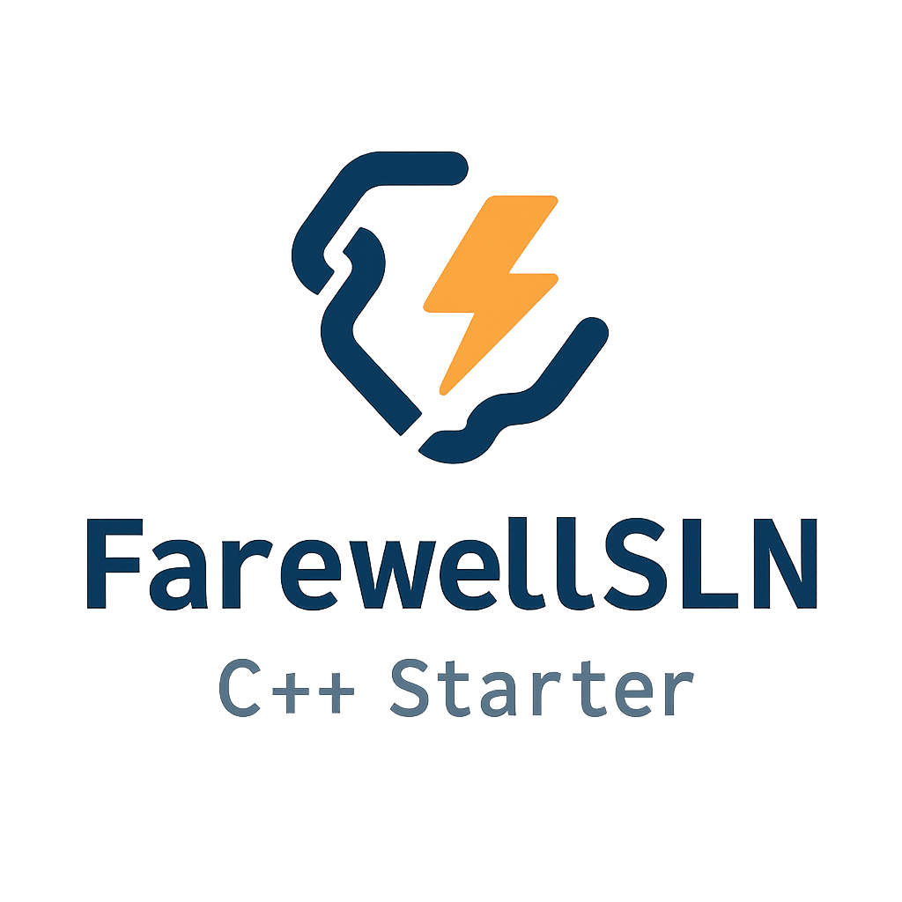

<p align="center">
  
</p>

<p align="center">
  C++ Starter · VSCode Scaffolder · Modern Template
</p>

# Farewell to Visual Studio .sln! | 告别 Visual Studio的.sln文件！ 
>Not all C++ projects need .sln shackles | 并非所有 C++ 项目都需要 .sln 的束缚         --FarewellSLN-Cpp-Starter  
## FarewellSLN-Cpp-Starter | A VSCode Project Generator
## FarewellSLN-Cpp-Starter | VSCode C++项目生成器
FarewellSLN-Cpp-Starter is a modern C++ project scaffolding tool designed for developers using Visual Studio Code.   
It automates the creation of standardized C++ project structures with preconfigured VSCode settings and supports integration of popular third-party libraries.  
FarewellSLN-Cpp-Starter 是一个现代 C++ 项目脚手架工具，专为使用 Visual Studio Code 的开发人员设计。  
它使用预配置的 VSCode 设置自动创建标准化 C++ 项目结构，并支持流行的第三方库的集成。
### Key Features  
•🚀 ​​One-click C++ project scaffolding​​​ | 🚀 ​​一键式 C++ 项目脚手架​​  
•⚙️ ​​Preconfigured VSCode development environment​​​ | ⚙️ ​​预配置的 VSCode 开发环境​​  
•📚 ​​Multiple third-party library integrations​ | 📚 ​​多个第三方库集成​​  
•🔒 ​​SHA256 verification for library integrity​ | 🔒 ​​SHA256 验证库完整性​​  
•📝 ​​Auto-generated library usage guides​​ | 📝 ​​自动生成的库使用指南​​  
•🛠️ ​​CMake build system support​​​ | 🛠️ ​​CMake 构建系统支持​​  
•📁 ​​Standardized directory structure​ | 📁 ​​标准化的目录结构​
### Quick Start 快速入门  
Compile the Tool 编译工具  
```
g++ -g main.cpp -o main.exe -std=c++17
```
or 或者  
Download the release pack 下载发布包  
Run 运行  
```
main.exe -n your project name -p your project dir
```
or 或者  
Double click open the CLI interface 双击打开 CLI 界面  
### F.A.Q. 常见问题  
Which platforms are supported? 支持哪些平台？  
As long as VS Code is available, you can use it. 只要有VS Code的地方可以用它


